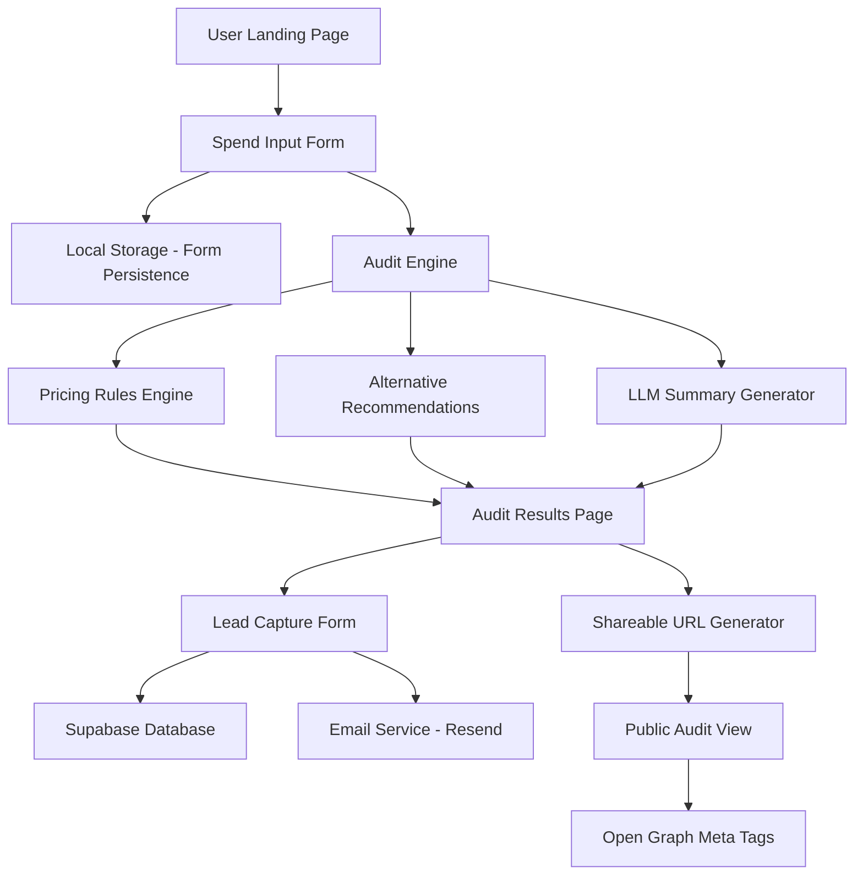

# Architecture

## System Overview



## Data Flow

### 1. User Input → Audit Result
1. User fills out form with AI tool spend data
2. Form state persists to localStorage on every change
3. On submit, data is validated using Zod schemas
4. Audit engine processes each tool:
   - Checks if current plan matches usage pattern
   - Calculates potential savings from downgrades
   - Identifies cheaper alternatives for use case
   - Applies Credex discount scenarios
5. LLM generates personalized summary (with fallback)
6. Results rendered with savings breakdown
7. Unique audit ID generated for shareable URL

### 2. Lead Capture → Storage
1. User enters email (+ optional company info)
2. Rate limiting check (max 5 audits per IP per hour)
3. Data stored in Supabase with audit results
4. Transactional email sent via Resend
5. High-value leads (>$500/mo savings) flagged

### 3. Shareable URL → Public View
1. Audit ID in URL path: `/audit/[id]`
2. Server-side fetch from Supabase
3. PII stripped (email, company name)
4. Open Graph tags generated dynamically
5. Public view rendered with savings data

## Tech Stack Justification

### Next.js 14 + TypeScript
**Why:**
- Server-side rendering for SEO and shareable URLs
- API routes eliminate need for separate backend
- Built-in image optimization
- Excellent TypeScript support
- Easy Vercel deployment with zero config
- App Router for better performance

**Alternatives considered:**
- Remix: Great DX but smaller ecosystem
- SvelteKit: Faster but less mature for production
- Vanilla React + Express: More boilerplate, slower development

### Tailwind CSS
**Why:**
- Rapid UI development
- Consistent design system
- Small bundle size with purging
- No CSS-in-JS runtime cost

### Supabase
**Why:**
- Postgres database with real-time capabilities
- Built-in auth (if needed for future admin panel)
- Row-level security
- Generous free tier
- Easy to migrate to self-hosted Postgres later

**Alternatives considered:**
- Firebase: More expensive, vendor lock-in
- Planetscale: Great but overkill for this scale
- MongoDB: Wrong data model for relational audit data

### Resend
**Why:**
- Modern API, great DX
- Generous free tier (100 emails/day)
- React email templates
- Good deliverability

### Anthropic API (Claude)
**Why:**
- Best at following instructions for structured output
- Good at concise summaries
- Credex sells Anthropic credits (brand alignment)

## Component Structure

```
app/
├── page.tsx                 # Landing page + form
├── audit/[id]/page.tsx      # Shareable audit results
├── api/
│   ├── audit/route.ts       # Generate audit
│   ├── lead/route.ts        # Capture lead
│   └── summary/route.ts     # LLM summary generation
├── components/
│   ├── SpendForm.tsx        # Multi-step form
│   ├── AuditResults.tsx     # Results display
│   ├── SavingsCard.tsx      # Per-tool breakdown
│   └── LeadCapture.tsx      # Email capture
└── lib/
    ├── audit-engine.ts      # Core audit logic
    ├── pricing-data.ts      # Pricing constants
    ├── supabase.ts          # DB client
    └── email.ts             # Email templates
```

## Scaling Considerations

### If this had to handle 10k audits/day:

1. **Database:**
   - Add read replicas for public audit views
   - Implement connection pooling (PgBouncer)
   - Add indexes on audit_id and created_at
   - Archive old audits to cold storage after 90 days

2. **Caching:**
   - Redis for rate limiting (currently in-memory)
   - Cache LLM summaries for identical input patterns
   - CDN caching for public audit pages (Vercel Edge)

3. **LLM Costs:**
   - Batch similar audits for single LLM call
   - Use cheaper models (GPT-3.5) for simple cases
   - Implement smart fallback to templates
   - Cache summaries for common tool combinations

4. **API Rate Limiting:**
   - Move from IP-based to token-based rate limiting
   - Implement exponential backoff
   - Add queue system (BullMQ) for async processing

5. **Monitoring:**
   - Add Sentry for error tracking
   - Implement analytics (PostHog or Plausible)
   - Set up alerts for API failures
   - Track conversion funnel metrics

6. **Infrastructure:**
   - Move to edge functions for global latency
   - Separate API and frontend deployments
   - Add load balancer for API routes
   - Implement graceful degradation (skip LLM if slow)

## Security Considerations

- Environment variables for all secrets
- Rate limiting on all public endpoints
- Input validation with Zod
- SQL injection prevention via Supabase client
- CORS configuration for API routes
- Honeypot field in lead capture form
- No PII in shareable URLs
- HTTPS enforced (Vercel default)
